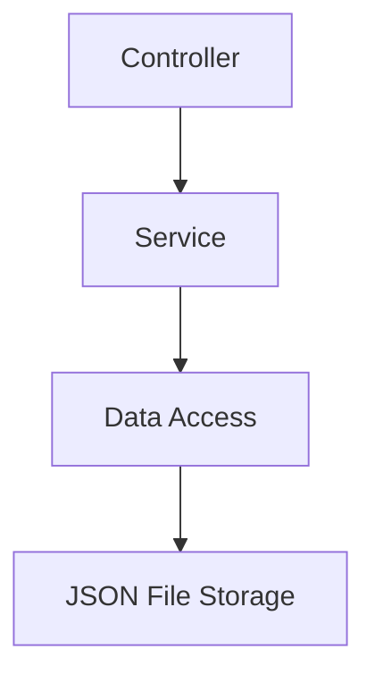
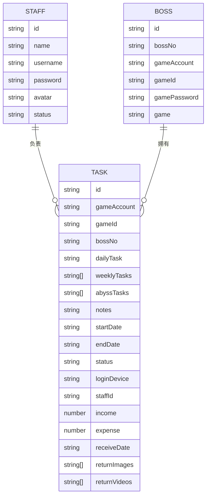

## 1. Architecture Design
采用 React + Express.js 的全栈架构，前端负责界面展示，后端提供 API 服务，数据存储使用 JSON 文件（简化版数据库）

```mermaid
flowchart TD
    A["Web 前端 (React + TypeScript)
    B["后端 API (Express.js + TypeScript)"] --> C["数据存储 (JSON 文件)"]
    A <--> |RESTful API | B
```

## 2. Technology Description
- 前端: React@18 + TypeScript + TailwindCSS + Vite
- 后端: Express@4 + TypeScript
- 状态管理: Zustand
- 路由: React Router DOM
- 甘特图: DHTMLX Gantt
- 初始化工具: vite-init

## 3. Route Definitions
| Route | Purpose |
|-------|---------|
| / | 登录页 |
| /admin | 管理员主页 |
| /admin/tasks/hosted | 托管任务页 |
| /admin/tasks/gantt | 托管返图页 |
| /admin/tasks/daily | 代肝任务页 |
| /admin/bosses | 老板管理页 |
| /admin/staff | 员工管理页 |
| /staff | 员工主页 |
| /staff/tasks/hosted | 员工托管任务页 |
| /staff/tasks/daily | 员工代肝任务页 |
| /staff/profile | 我的页面 |

## 4. API Definitions

### Type Definitions
```typescript
interface Boss {
  id: string;
  bossNo: string;
  gameAccount: string;
  gameId: string;
  gamePassword: string;
  game: string;
}

interface Staff {
  id: string;
  name: string;
  username: string;
  password: string;
  avatar?: string;
  status: 'active' | 'inactive';
}

interface Task {
  id: string;
  gameAccount: string;
  gameId: string;
  bossNo: string;
  dailyTask: 'daily' | 'fullStamina' | 'dailyStamina' | null;
  weeklyTasks: string[];
  abyssTasks: string[];
  notes: string;
  startDate: string;
  endDate: string;
  status: string;
  loginDevice: string;
  staffId: string;
  income: number;
  expense: number;
  receiveDate: string;
  returnImages: string[];
  returnVideos: string[];
}
```

### API 接口
| Method | Path | Description |
|--------|------|-------------|
| GET | /api/bosses | 获取老板列表 |
| POST | /api/bosses | 新增老板 |
| PUT | /api/bosses/:id | 更新老板 |
| GET | /api/staff | 获取员工列表 |
| POST | /api/staff | 新增员工 |
| PUT | /api/staff/:id | 更新员工 |
| DELETE | /api/staff/:id | 删除员工 |
| GET | /api/tasks | 获取任务列表 |
| POST | /api/tasks | 新增任务 |
| PUT | /api/tasks/:id | 更新任务 |

## 5. Server Architecture Diagram



## 6. Data Model

### 6.1 Data Model Definition



### 6.2 Data Definition Language
项目使用 JSON 文件作为存储，初始化数据如下:
- `data/bosses.json`, `data/staff.json`, `data/tasks.json`
