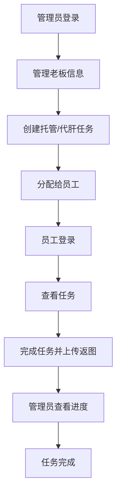

## 1. Product Overview
代肝任务管理系统是一款用于管理游戏代肝业务的全功能Web应用，支持Web端和移动端访问，数据实时同步。解决了游戏代肝业务中任务管理、人员管理、财务管理的一体化解决方案。
- 主要服务于游戏代肝业务的管理员和员工，分别提供管理员系统和员工系统
- 目标是提升代肝业务管理效率，实现任务、人员、财务的规范化管理

## 2. Core Features

### 2.1 User Roles
| Role | Registration Method | Core Permissions |
|------|---------------------|------------------|
| 管理员 | 预设账号登录 | 完整权限：托管任务管理、代肝任务管理、老板管理、员工管理、任务返图查看 |
| 员工 | 预设账号登录 | 查看和管理自己的任务、上传图片和视频、修改个人信息 |

### 2.2 Feature Module
1. **管理员系统-托管任务页面：任务列表、筛选、新增、编辑
2. **管理员系统-托管返图页面：甘特图展示任务返图进度
3. **管理员系统-代肝任务页面：任务列表管理
4. **管理员系统-老板管理页面：老板信息管理
5. **管理员系统-员工管理页面：员工信息管理
6. **员工系统-托管任务页面：查看自己的托管任务，上传图片视频
7. **员工系统-代肝任务页面：查看自己的代肝任务，上传图片视频
8. **员工系统-我的页面：修改头像和密码

### 2.3 Page Details
| Page Name | Module Name | Feature description |
|-----------|-------------|---------------------|
| 托管任务页面 | 任务列表 | 多列筛选（游戏账号、游戏ID、老板编号、日任务、周任务、深渊任务、备注、开始日期、结束日期、状态、登录设备、负责员工、金额、收款日期） |
| 托管任务页面 | 新增/编辑任务 | 完整表单、员工下拉选择、老板搜索选择、日/周/深渊任务选项、日期选择、金额输入 |
| 托管返图页面 | 甘特图展示 | 以甘特图方式查看所有任务返图进度 |
| 老板管理页面 | 老板管理 | 新增/编辑/查看老板信息 |
| 员工管理页面 | 员工管理 | 新增/编辑/删除/查看员工状态 |
| 员工任务页面 | 任务列表 | 查看自己的任务、上传图片和视频 |
| 我的页面 | 个人信息 | 修改头像、修改密码 |

## 3. Core Process
管理员登录系统 → 管理任务/老板/员工 → 分配任务给员工 → 员工登录系统 → 查看任务 → 上传返图 → 管理员查看进度 → 完成任务

## 4. User Interface Design
### 4.1 Design Style
- 主色调：蓝色系 (#165DFF，专业高效
- 辅助色：绿色 (#00B42A) 表示成功、橙色 (#FF7D00) 表示警告
- 按钮风格：圆角矩形，悬浮时颜色加深，带有微阴影
- 字体：Inter 系字体，标题加粗，正文清晰易读
- 布局风格：侧边导航 + 主内容区，响应式设计
- 图标：使用 Lucide React 图标库

### 4.2 Page Design Overview
| Page Name | Module Name | UI Elements |
|-----------|-------------|-------------|
| 托管任务页面 | 任务列表 | 表格布局、筛选按钮、分页 |
| 托管任务页面 | 新增/编辑 | 表单布局、标签与输入框并排 |
| 托管返图页面 | 甘特图 | 甘特图组件、进度显示 |
| 老板/员工管理 | 管理列表 | 卡片或表格 |
| 员工任务页面 | 任务卡片 | 卡片布局、上传按钮 |

### 4.3 Responsiveness
采用桌面优先，移动端适配，确保在手机和平板上也能正常使用，优化触摸操作

### 4.4 3D Scene Guidance
本项目不涉及3D场景
